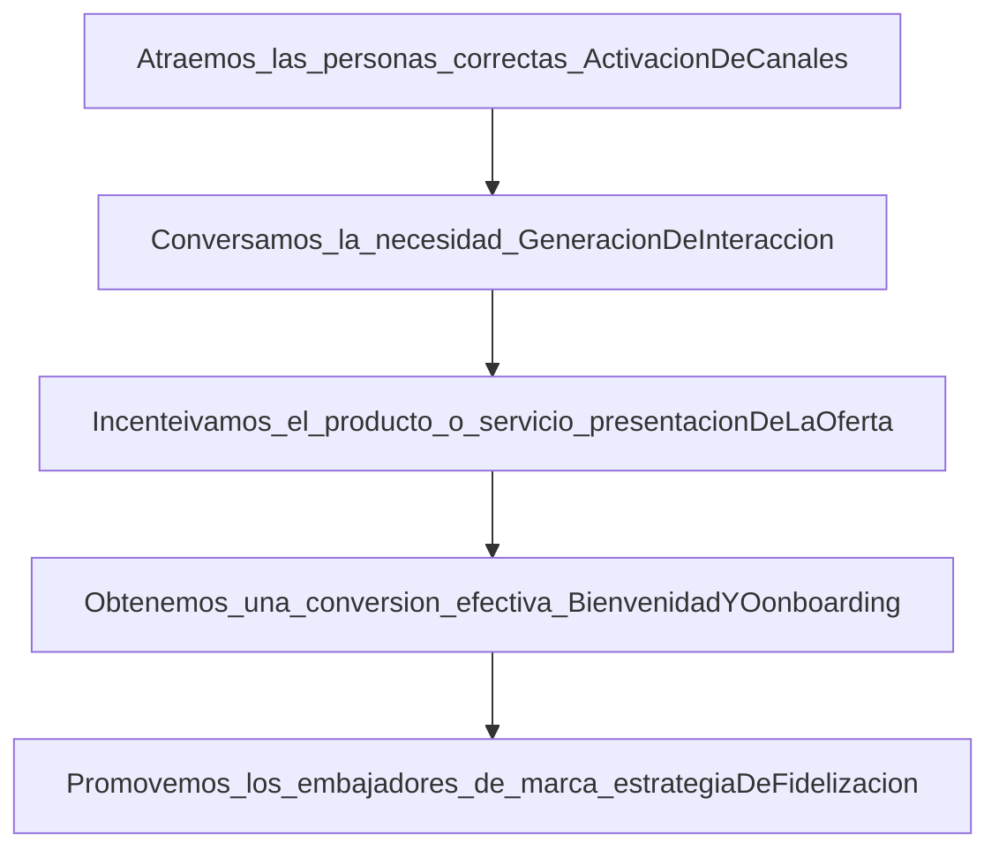
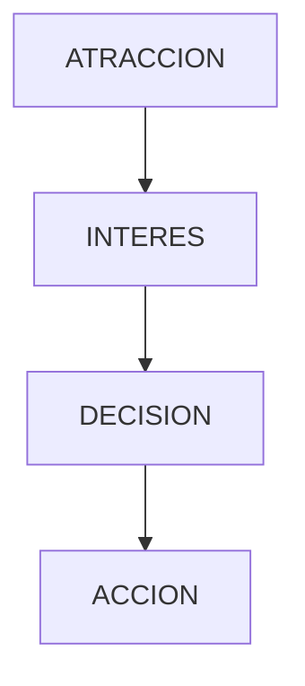

# Las 6 C de la motivacion del cliente


## 1 Customizacion /personalizacion 

    tu cliente desea encontrar una solucion a su problema , el nunca piensa de forma general por eso debes entender su escenario
    
    ejemplo "quiero comprar un automovil para viajar de forma comoda"

## 2 Comunidad

funciona como respaldo y garantia , ademas de sentir que encon tro un espacio para compartir y validar su necesidad 

* confianza
* Seguridad de la marca
* Espacio para enocar el recorrido de los usuarios 


## 3 convencience / satisfaccion  


El objetivo de tener una motivacion o necesidad es encontrar al inal satisfaccion , que podemos construirla a lo largo del recorrido de ventas en el funnel de negocio 

degustacion o trial

contenido personalizado

tipo de sensacion 


## 4 costo / precio

es el pensamiento interno de tus usuarios , momento de activacion racional evaluado se tu producto o servicio tiene un precio alto o bajo


En esta etapa debes aprender a trabajar la presuasion en todos los canales de comunicacion de tu ecosistema 

## 5 Choice /Eleccion 

La mente del usuario pasa por 3 tipos de capas para tomar una decision , este termino lo puedes rescatar de la neurociencia 

Emocional 

Racional

Reptiliano 


## 6 content /contenido 

un buen contenido puede incentivar la decision asi mismo como un mal contenido puede retirar el usuario del recorrido de la venta 


# Como funciona un embudo de marketing en tu negocio 


## objetivos del embudo

* Una accion medible que genera un impacto  en tu negocio 


* La sumatoria de todas las etapas para alcanzar la ventana efectiva 

## como estructurar tu objetivo en cada etapa ?

* Una accion Medible que genera un impacto en el negocio 

* Puedes plantear una metodologia UMTM/NSM 


Ejemplo de vender un producto 

* vender mas productos  === incorrecto

* en los primeros 3 meses vender 342 kits de limpieza para carros   === correcto 

tenemos un periodo de tiempo una cantidad y un producto en especifico 





# La estructura base de tu embudo de ventas 

## Modelo AIDA 

Es el mas usado para calificar a los usuarios en todo su recorrido de orma semi automatizada

se utiliaza con frecuencia B2C



## OFU  

cada etape tiene mayor profundidad en el  recorrido para tu usuario , lo que permite calificarlo al detalle , este tipo de funnel se usa con recuencia para B2B 

```mermaid
  graph TD;

Tofu --> MOFU
MOFU --> BOFU


  ```

  # acciones de decision en un embudo de venta 

  
# que debes tener antes de comenzar a hacer tu embudo 

https://platzi.com/clases/2314-terminos-marketing-digital/37662-que-es-buyer-persona/ 

Trafico frio 

trafico templado 

trafico caliente 


# primera etapa  recorriendo el arareness o estade de consiencia 


## primera etapa 

posicionamiento de tu marca 

estrategia  con SEO /SEM

Contenido en redes cociales 